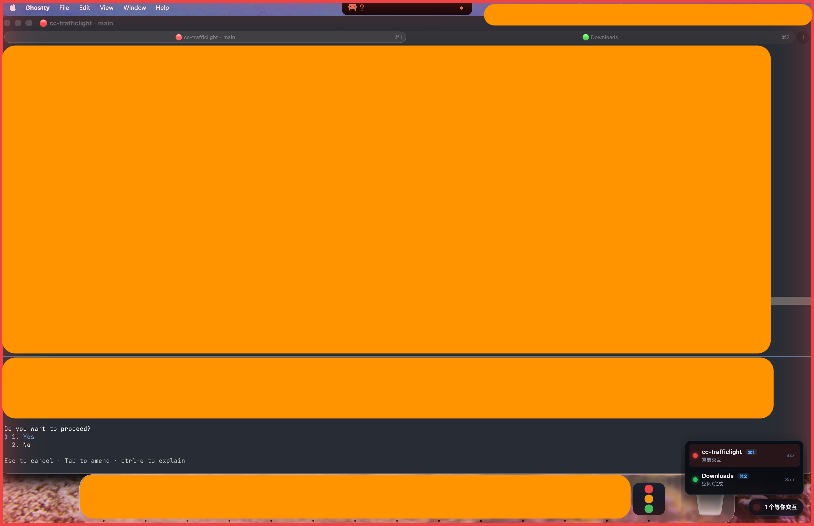

# cc-trafficlight · Claude Code 状态灯

一个 macOS 桌面小工具：用「红绿灯」实时显示你每个 Claude Code 会话的状态，**需要你确认时主动提醒**，再也不会让 Claude 干等着你。

- 🟢 空闲 / 完成　🟡 工作中　🔵 空闲等你输入　🔴 需要交互（如权限请求）
- 屏幕右下角一个**悬浮小药丸**，点开能看到所有会话列表，**点一下直接跳到对应的终端标签**
- 有会话「需要交互」时：**全屏边框红光脉冲 + 系统通知 + 提示音**，怎么都不会错过
- 每个 Ghostty 标签标题前会显示状态小圆点



> 上图：某个会话「需要你确认」时，屏幕四周红光脉冲，右下角药丸展开会话列表（🔴 需要交互 / 🟢 空闲），一眼就知道该回哪个标签。

---

## 一、运行环境

- **Mac（Apple 芯片，M1/M2/M3…）**
- 终端用 **[Ghostty](https://ghostty.org)**
- 已安装 **Claude Code**（`claude` 命令）

> 目前只支持 Apple 芯片 + Ghostty。

---

## 二、安装（跟着做即可，约 3 分钟）

### 第 1 步：下载

到 **[Releases 页面](https://github.com/furaul/cc-trafficlight/releases/latest)** 下载最新的
`cc-trafficlight_x.x.x_aarch64.dmg`。

### 第 2 步：安装 App

1. 双击下载好的 `.dmg`。
2. 在弹出的窗口里，把 **cc-trafficlight 图标拖进「应用程序(Applications)」文件夹**。

### 第 3 步：第一次打开（重要！）

这个 App 没有花钱做 Apple 签名，所以第一次打开 macOS 会拦一下。**不要双击**，按下面做：

1. 打开「应用程序」文件夹，找到 **cc-trafficlight**。
2. **右键点它 → 选「打开」**。
3. 弹窗里再点一次「**打开**」。

> 如果提示「已损坏 / 无法打开」，复制下面这行到「终端」运行一次，再重新打开即可：
> ```bash
> xattr -dr com.apple.quarantine /Applications/cc-trafficlight.app
> ```

打开后，屏幕**右下角会出现一个小药丸**，就说明 App 起来了 ✅

### 第 4 步：安装提示钩子（让 Claude Code 上报状态）

App 本身只是「显示器」，还需要装一个小钩子让 Claude Code 把状态告诉它。

打开「终端」，**整段复制**下面命令运行（会自动下载钩子脚本并配置好）：

```bash
mkdir -p ~/.cc-trafficlight && \
curl -fsSL https://raw.githubusercontent.com/furaul/cc-trafficlight/main/hook/cc-trafficlight-hook.sh -o ~/.cc-trafficlight/cc-trafficlight-hook.sh && \
curl -fsSL https://raw.githubusercontent.com/furaul/cc-trafficlight/main/hook/install.sh -o ~/.cc-trafficlight/install.sh && \
chmod +x ~/.cc-trafficlight/*.sh && \
bash ~/.cc-trafficlight/install.sh
```

看到 `Installed cc-trafficlight hooks ...` 就成功了。

> 这一步会修改 `~/.claude/settings.json`（自动加 8 个 hook + 一个环境变量），并且**对已经开着的 Claude Code 会话不生效——需要重开会话**。

### 第 5 步：授权（让「点击跳转」能用）

「点一下列表跳到对应标签」这个功能需要 macOS 授权。第一次点击跳转时会弹授权框，**全部点「允许」**即可。如果没弹或点不动，手动授权：

打开 **系统设置 → 隐私与安全性**，分别在这两项里把 **cc-trafficlight** 打开：

1. **辅助功能（Accessibility）**：点 `+` 添加 `/Applications/cc-trafficlight.app`，打开开关。
2. **自动化（Automation）**：找到 cc-trafficlight，勾上下面的 **System Events** 和 **Ghostty**。

> 改完权限后**退出并重新打开 cc-trafficlight**（权限才生效）。

完成！现在在 Ghostty 里开几个标签各跑一个 `claude`，右下角药丸就会实时显示状态了。

---

## 三、怎么用

- 平时不用管它，挂在右下角。
- **点一下小药丸** → 展开所有会话列表（项目名 + 状态 + ⌘几号标签 + 已运行时长）。
- **点列表里某一行** → 直接跳到那个 Ghostty 标签。
- 某个会话**需要你确认**时：屏幕四周红光闪一下 + 通知 + 提示音。
- **右键小药丸** → 开关提示音。

---

## 四、常见问题

**Q：药丸不显示？**
确认是用「应用程序」里的 App 打开的（不是源码里的调试程序）。重开一次试试。

**Q：标签标题没有彩色圆点？**
钩子需要重开会话才生效。关掉旧的 Claude Code 标签，新开一个再试。

**Q：点列表跳转没反应？**
没授权。按「第 5 步」开启辅助功能 + 自动化，然后重启 App。

**Q：列表里的会话数和我开的标签对不上？**
列表只显示「正在跑 claude」的标签；纯 shell 的标签不算。关掉的标签会自动从列表消失。

**Q：升级了新版本后又要重新授权？**
是的，未签名 App 每次更新签名会变，需要重新授权一次。

---

## 五、卸载

```bash
# 1. 删 App
rm -rf /Applications/cc-trafficlight.app
# 2. 移除钩子（手动编辑，删掉 ~/.claude/settings.json 里 hooks 中 cc-trafficlight 相关项，
#    以及 env 里的 CLAUDE_CODE_DISABLE_TERMINAL_TITLE）
# 3. 删状态/脚本
rm -rf ~/.cc-trafficlight ~/.local/state/cc-trafficlight
```

---

## 六、给开发者：从源码构建

```bash
git clone https://github.com/furaul/cc-trafficlight.git
cd cc-trafficlight

# 装 hook
bash hook/install.sh

# 跑/构建 App（需要 Rust、Node、Xcode Command Line Tools）
cd app
npm install
npm run tauri dev      # 开发模式
npm run tauri build    # 出 .app / .dmg，产物在 src-tauri/target/release/bundle/
```

测试：

```bash
bash hook/tests/hook_test.sh           # hook 脚本
cd app/src-tauri && cargo test --lib   # Rust 聚合/扫描/边沿逻辑
```

### 架构

两层：

1. **hook 层**（`hook/`）：每个 Claude Code 会话的 hook 把状态写到 `~/.local/state/cc-trafficlight/sessions/<id>.json`，并用 OSC 转义序列把状态圆点写进 Ghostty 标签标题。需配合 `CLAUDE_CODE_DISABLE_TERMINAL_TITLE=1`（install.sh 自动设置）防止被 Claude Code 自带标题覆盖。
2. **App 层**（`app/`，Tauri v2 + Rust）：监听状态目录、聚合（最紧急优先），渲染角落药丸 + 会话清单 + 全屏边框脉冲，并通过 macOS 辅助功能读取 Ghostty 标签实现编号与点击跳转。

设计文档与实施计划见 `docs/superpowers/`。

## 许可

MIT
